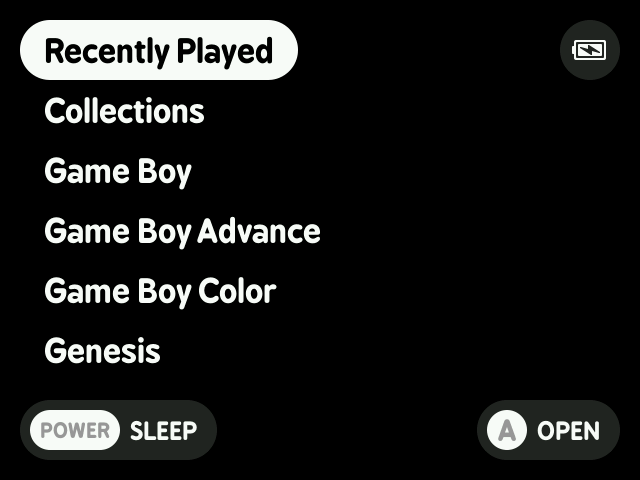
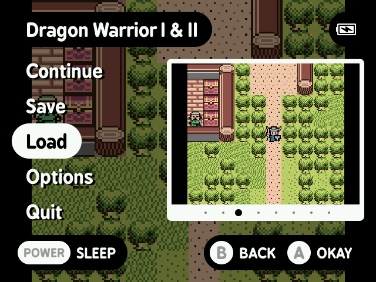

# Installation Instructions

1. **Extract the Image File**  
   Extract the `MinUI-Legacy-RG35XX-MicroSDCardImage.7z` archive. This will reveal the `MinUI-Legacy-RG35XX.img` file.

2. **Flash the Image to the microSD Card**  
   Use a flashing tool (such as Balena Etcher or Win32 Disk Imager) to write the `MinUI-Legacy-RG35XX.img` file to your microSD card.

3. **Insert the microSD Card**  
   Place the flashed microSD card into the **TF1** slot of your RG35XX device. Leave the **TF2** slot empty.

4. **Power On and Boot**  
   Power on your RG35XX. The system will boot into MinUI-Legacy-RG35XX from the microSD card. During the first boot, the system will automatically resize the ROMS partition to use the maximum available space on the card. This process may take a few minutes. Once completed, the device will automatically reboot, and the installation process for MinUI-Legacy-RG35XX will begin as normal.

5. **Reinitialize the ROMS Partition (Optional)**  
   To reset the ROMS partition, place an empty file named `init_roms` in the **BOOT** partition of the microSD card. On the next boot, the system will reinitialize the ROMS partition.

-------
# MinUI

MinUI is a focused custom launcher for the Anbernic RG35XX (and possibly others to come).

   
See [more screenshots](github/).

## Features

- Simple launcher, simple SD card
- No settings or configuration
- No boxart, themes, or distractions
- Automatically hides extension 
  and region/version cruft in 
  display names
- Consistent in-emulator menu with
  quick access to save states, disc
  changing, and emulator options
- Automatically sleeps after 30 seconds 
  or press POWER to sleep (and wake)
- Automatically powers off while asleep
  after two minutes or hold POWER for
  one second
- Automatically resumes right where
  you left off if powered off while
  in-game, manually or while asleep
- Resume from manually created, last 
  used save state by pressing X in 
  the launcher instead of A
- Streamlined emulator frontend 
  (minarch + libretro cores)

You can [grab the latest version here](https://github.com/shauninman/union-minui/releases).

## Developers

I am not soliciting contributions. Please feel free to fork or learn from any of my repos but I don't have time to manage a community or interest in being managed by someone else. Thanks for understanding.
